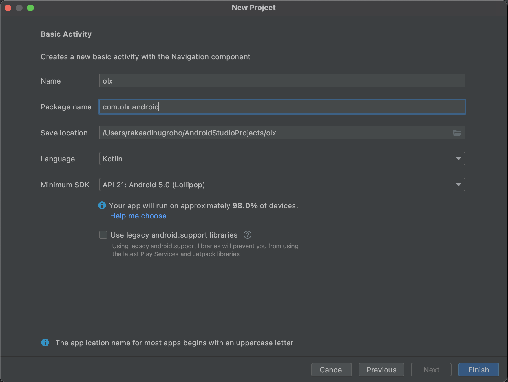
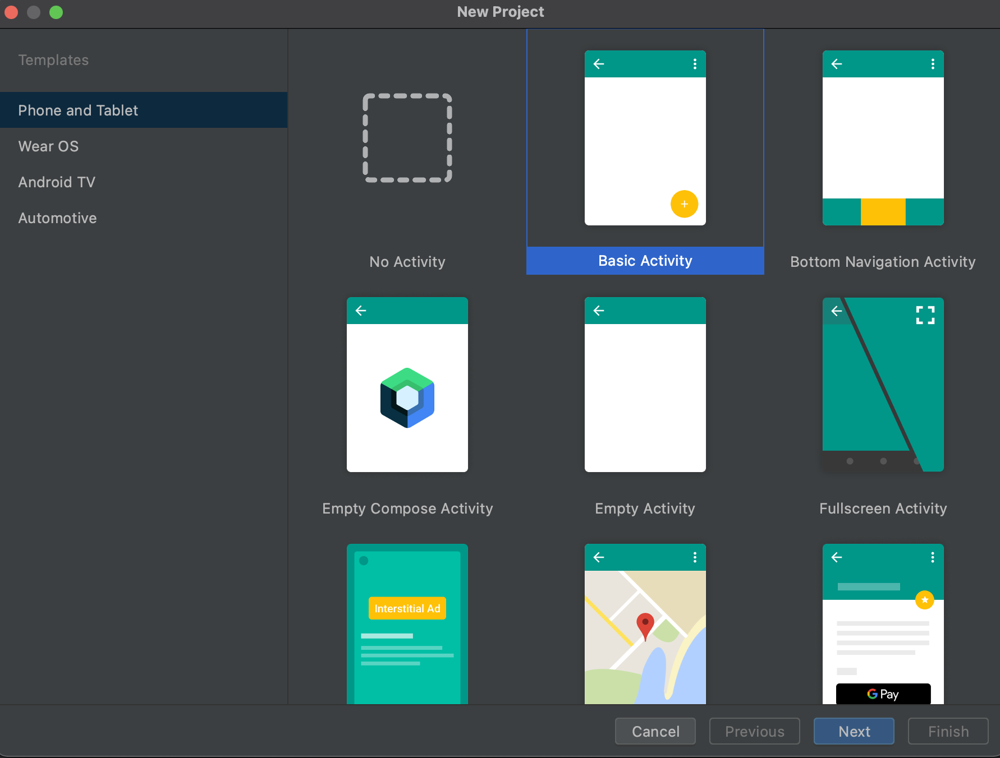
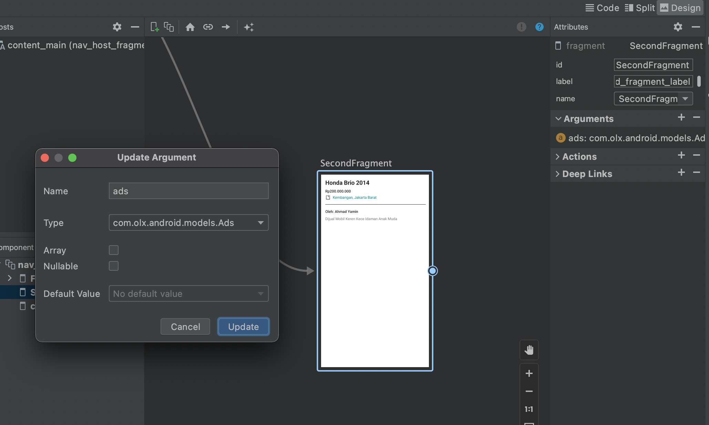
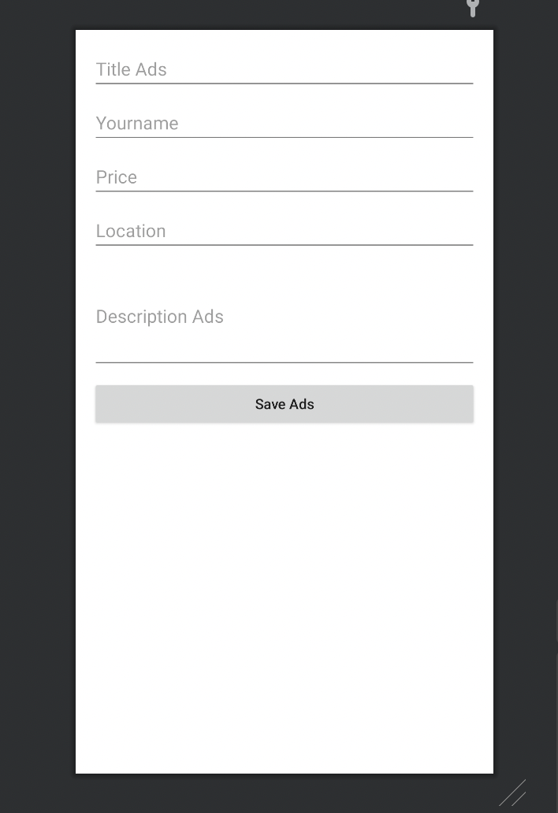
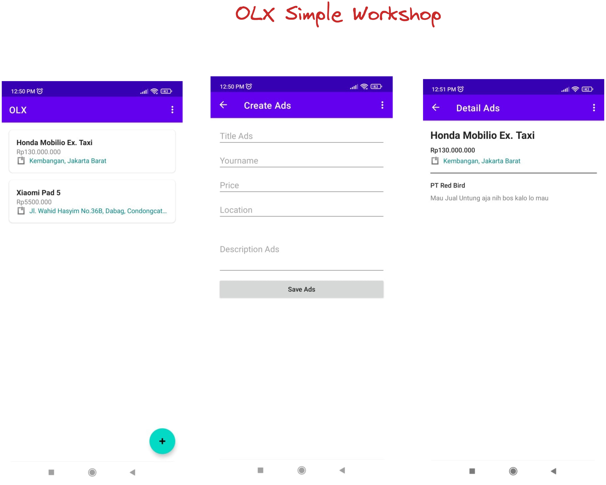

# Build Classified Ads Application

### Architecture


Database : [Firebase Realtime Database]([Firebase Realtime Database &nbsp;|&nbsp; Firebase Documentation](https://firebase.google.com/docs/database))

### Setting Up Project

create your 1st application, use BasicActivity template





### Slicing Layout

in this case, we want to use just one `Activity`, and page will use `fragment`

#### List of Ads

1. use `firstFragment.kt` as `listOfAds Fragment`

2. in this part, we use `recyclerview` to handle list of ads, and `floating button` to open `create ads page`

3. change `fragment_first.xml`
   
   ```xml
   <androidx.coordinatorlayout.widget.CoordinatorLayout xmlns:android="http://schemas.android.com/apk/res/android"
       xmlns:tools="http://schemas.android.com/tools"
       android:layout_width="match_parent"
       android:layout_height="match_parent"
       xmlns:app="http://schemas.android.com/apk/res-auto"
       tools:context=".FirstFragment">
   
       <androidx.recyclerview.widget.RecyclerView
           android:id="@+id/rv_list_ads"
           android:layout_width="match_parent"
           android:layout_height="match_parent" />
   
       <com.google.android.material.floatingactionbutton.FloatingActionButton
           android:id="@+id/fab_create_ads"
           android:layout_width="wrap_content"
           android:layout_height="wrap_content"
           android:layout_gravity="bottom|end"
           android:layout_marginEnd="@dimen/fab_margin"
           android:layout_marginBottom="16dp"
           app:srcCompat="@android:drawable/ic_input_add" />
   </androidx.coordinatorlayout.widget.CoordinatorLayout>
   ```

4. create new layout file to showing the ads item `item_ads.xml`
   
   ```xml
   <?xml version="1.0" encoding="utf-8"?>
   <androidx.cardview.widget.CardView android:id="@+id/container_ads"
       android:layout_width="match_parent"
       android:layout_height="wrap_content"
       android:layout_marginHorizontal="16dp"
       android:layout_marginTop="16dp"
       app:cardCornerRadius="8dp"
       xmlns:android="http://schemas.android.com/apk/res/android"
       xmlns:app="http://schemas.android.com/apk/res-auto">
       <LinearLayout
           android:padding="16dp"
           android:orientation="vertical"
           android:layout_width="match_parent"
           android:layout_height="wrap_content">
   
           <androidx.appcompat.widget.AppCompatTextView
               android:id="@+id/tv_title_ads"
               android:layout_width="match_parent"
               android:layout_height="wrap_content"
               android:text="Honda Brio 2014"
               android:textAppearance="@style/TextAppearance.AppCompat.Large"
               android:textSize="16sp"
               android:textStyle="bold" />
           <androidx.appcompat.widget.AppCompatTextView
               android:id="@+id/tv_price_ads"
               android:text="Rp12.000.000"
               android:layout_width="match_parent"
               android:layout_height="wrap_content"/>
   
           <LinearLayout
               android:layout_width="match_parent"
               android:layout_height="wrap_content">
               <androidx.appcompat.widget.AppCompatImageView
                   android:src="@android:drawable/ic_input_get"
                   android:layout_width="20dp"
                   android:layout_height="20dp"/>
   
               <TextView
                   android:id="@+id/tv_location_ads"
                   android:layout_width="match_parent"
                   android:layout_height="wrap_content"
                   android:ellipsize="end"
                   android:maxLines="1"
                   android:paddingLeft="8dp"
                   android:text="Kembangan, Jakarta Barat"
                   android:textAppearance="@style/TextAppearance.AppCompat.Small"
                   android:textColor="@color/teal_700" />
           </LinearLayout>
       </LinearLayout>
   </androidx.cardview.widget.CardView>
   ```

5. to handle the object of data, we need to create `data class` 
   
   sample of data structure
   
   ```jsonp
   {
       "author": "PT Red Bird",
       "description": "Mau Jual Untung aja nih bos kalo lo mau",
       "location": "Kembangan, Jakarta Barat",
       "price": "Rp130.000.000",
       "title": "Honda Mobilio Ex. Taxi"
   }
   ```
   
   create the dataclass with new package `models/Ads.kt`
   
   ```kotlin
   data class Ads(
       var author: String = "",
       var description: String = "",
       var location: String = "",
       var price: String = "",
       var title: String = ""
   )
   ```
   
   because we don't have data source for now, we need to generate dummy data. You can create generator inside `Ads` data class, so you can modify to be
   
   ```kotlin
   companion object {
           fun generateDummyAds(): List<Ads> {
               val listOfAds = arrayListOf<Ads>()
               for (i in 1..10) {
                   if (i%2==0) {
                       listOfAds.add(
                           Ads(
                               author = "Samsul Arifin",
                               description = "OLX Autos adalah solusi terbaik untuk jual mobil secara instan, aman dan nyaman. Dapatkan harga terbaik sesuai dengan kondisi mobil kamu.",
                               location = "Kembangan, Jakarta Barat",
                               price = "Rp175.000.000",
                               title = "Honda Brio RS 2015",
                           )
                       )
                   } else {
                       listOfAds.add(
                           Ads(
                               author = "Hamka Hamzah",
                               description = "Mesin asli bensin\n" +
                                       "4x4 aktif.\n" +
                                       "Surat surat lengkap.\n" +
                                       "Pajak hidup.\n" +
                                       "power steering\n" +
                                       "Sudah pakek pakum rem",
                               location = "Kembangan, Jakarta Barat",
                               price = "Rp75.000.000",
                               title = "Hyundai Atoz 2008",
                           )
                       )
                   }
               }
   
               return listOfAds
           }
       }
   ```

6. Create adapter to handle recyclerview item, you need to `AdsAdapter.kt` to create Recyclerview Adapter inside `adapters/AdsAdapter.kt` package [[references](https://developer.android.com/guide/topics/ui/layout/recyclerviewhttps://developer.android.com/guide/topics/ui/layout/recyclerview)]
   
   ```kotlin
   class AdsAdapter(private val items: List<Ads>, private val listener: AdsListener): RecyclerView.Adapter<AdsAdapter.AdsViewHolder>() {
   
       inner class AdsViewHolder(val binding: ItemAdsBinding): RecyclerView.ViewHolder(binding.root)
   
       override fun onCreateViewHolder(parent: ViewGroup, viewType: Int): AdsViewHolder {
           val binding = ItemAdsBinding.inflate(LayoutInflater.from(parent.context), parent, false)
           return AdsViewHolder(binding)
       }
   
       override fun onBindViewHolder(holder: AdsViewHolder, position: Int) {
           with(holder) {
               with(items[position]) {
                   binding.tvTitleAds.text = this.title
                   binding.tvLocationAds.text = this.location
                   binding.tvPriceAds.text = this.price
   
                   binding.containerAds.setOnClickListener {
                       listener.onClickAds(this)
                   }
               }
           }
       }
   
       override fun getItemCount(): Int = items.size
   }
   ```
   
   to handle click event to your item, you need to write interface as a callback event, create new interface `AdsListener` inside `adapters` package
   
   ```kotlin
   interface AdsListener {
       fun onClickAds(ads: Ads)
   }
   ```

7. Modify your `firstFragment.kt`
   
   ```kotlin
   class FirstFragment : Fragment(), AdsListener {
   
       private var _binding: FragmentFirstBinding? = null
       private val binding get() = _binding!!
   
       private val database by lazy { Database() }
   
       private var listOfAds: ArrayList<Ads>  = arrayListOf()
       private lateinit var adsAdapter : AdsAdapter
   
       override fun onCreateView(
           inflater: LayoutInflater, container: ViewGroup?,
           savedInstanceState: Bundle?
       ): View? {
   
           _binding = FragmentFirstBinding.inflate(inflater, container, false)
           adsAdapter = AdsAdapter(listOfAds, this)
           return binding.root
   
       }
   
       override fun onViewCreated(view: View, savedInstanceState: Bundle?) {
           super.onViewCreated(view, savedInstanceState)
   
           with(binding.rvListAds) {
               adapter = adsAdapter
               layoutManager = LinearLayoutManager(requireContext())
           }
       }
   
       override fun onDestroyView() {
           super.onDestroyView()
           _binding = null
       }
   
       override fun onClickAds(ads: Ads) {
           // TODO: go to detail page
       }
   }
   ```

##### Detail Page

1. change the layout `fragment_second.xml`
   
   ```kotlin
   <?xml version="1.0" encoding="utf-8"?>
   <LinearLayout xmlns:android="http://schemas.android.com/apk/res/android"
       xmlns:tools="http://schemas.android.com/tools"
       android:layout_width="match_parent"
       android:layout_height="match_parent"
       android:orientation="vertical"
       android:padding="16dp"
       tools:context=".SecondFragment">
   
       <androidx.appcompat.widget.AppCompatTextView
           android:id="@+id/tv_title_detail"
           android:layout_width="match_parent"
           android:layout_height="wrap_content"
           android:text="Honda Brio 2014"
           android:textAppearance="@style/TextAppearance.AppCompat.Large"
           android:textStyle="bold" />
   
       <androidx.appcompat.widget.AppCompatTextView
           android:id="@+id/tv_price_detail"
           android:layout_width="match_parent"
           android:layout_height="wrap_content"
           android:text="Rp200.000.000"
           android:layout_marginTop="8dp"
           android:textAppearance="@style/TextAppearance.AppCompat.Body2" />
   
       <LinearLayout
           android:layout_marginTop="4dp"
           android:layout_width="match_parent"
           android:layout_height="wrap_content">
           <androidx.appcompat.widget.AppCompatImageView
               android:src="@android:drawable/ic_input_get"
               android:layout_width="20dp"
               android:layout_height="20dp"/>
   
           <TextView
               android:id="@+id/tv_location_detail"
               android:layout_width="match_parent"
               android:layout_height="wrap_content"
               android:ellipsize="end"
               android:maxLines="1"
               android:paddingLeft="8dp"
               android:text="Kembangan, Jakarta Barat"
               android:textAppearance="@style/TextAppearance.AppCompat.Small"
               android:textColor="@color/teal_700" />
       </LinearLayout>
   
       <View
           android:background="@color/black"
           android:layout_marginVertical="16dp"
           android:layout_width="match_parent"
           android:layout_height="1dp" />
   
       <androidx.appcompat.widget.AppCompatTextView
           android:id="@+id/tv_author_detail"
           android:layout_width="match_parent"
           android:layout_height="wrap_content"
           android:text="Oleh: Ahmad Yamin"
           android:textAppearance="@style/TextAppearance.AppCompat.Body2" />
   
       <androidx.appcompat.widget.AppCompatTextView
           android:id="@+id/tv_desc_detail"
           android:layout_width="match_parent"
           android:layout_height="wrap_content"
           android:layout_marginTop="8dp"
           android:text="Dijual Mobil Keren Kece Idaman Anak Muda"
           android:textAppearance="@style/TextAppearance.AppCompat.Small" />
   </LinearLayout>
   ```

2. in the detail page, you just need to show the data which passing from ads list, so you can consume the data from `Bundle` [[references](https://developer.android.com/reference/android/os/Bundle)]

3. modify `ads` data class as `Parcelable`, before that you need to add plugins into you gradle app
   
   ```maven
   plugins {
       ...your default plugin
       id 'kotlin-parcelize'
   }
   ```
   
   ```kotlin
   @Parcelize
   data class Ads(
       var author: String = "",
       var description: String = "",
       var location: String = "",
       var price: String = "",
       var title: String = ""
   ): Parcelable
   ```
   
   handle argument with navigation graph [[references](https://developer.android.com/guide/navigation/navigation-getting-started)]
   
   

4. modify your `SecondFragment.kt`
   
   ```kotlin
   class SecondFragment : Fragment() {
   
       private var _binding: FragmentSecondBinding? = null
       private val binding get() = _binding!!
   
       override fun onCreateView(
           inflater: LayoutInflater, container: ViewGroup?,
           savedInstanceState: Bundle?
       ): View? {
   
           _binding = FragmentSecondBinding.inflate(inflater, container, false)
           return binding.root
   
       }
   
       override fun onViewCreated(view: View, savedInstanceState: Bundle?) {
           super.onViewCreated(view, savedInstanceState)
   
           (arguments?.get("ads") as Ads?)?.let { ads ->
               binding.tvTitleDetail.text = ads.title
               binding.tvAuthorDetail.text = ads.author
               binding.tvDescDetail.text = ads.description
               binding.tvPriceDetail.text = ads.price
               binding.tvLocationDetail.text = ads.location
           }
       }
   
       override fun onDestroyView() {
           super.onDestroyView()
           _binding = null
       }
   }
   ```

##### Handle From List Page to Detail Page

1. modify your `onClickAds` listener to open `secondFragment` and passing the ads data
   
   ```kotlin
   override fun onClickAds(ads: Ads) {
           findNavController().navigate(R.id.action_FirstFragment_to_SecondFragment, bundleOf("ads" to  ads))
       }
   ```

##### Connect to Firebase

1. simply you can use assistant feature in Android studio to connect your project with Firebase `tools -> firebase -> Realtime Database`

2. firebase assistant will open on you sidebar, you just need to click `connect` to implement firebase in your project.

3. create class to handle all of `database` transaction. Create `Database.kt` inside `utils/Database.kt` package
   
   ```kotlin
   class Database {
       private val path = "ads"
   
       private var database: FirebaseDatabase = FirebaseDatabase.getInstance()
   
       private fun getReference(): DatabaseReference {
           return database.getReference(path)
       }
   
       // function to create new Ads
       fun createAds(ads: Ads) {
           getReference().push().setValue(ads)
       }
   
       // function to read ads
       fun readAds(onSuccess: (List<Ads>) -> (Unit), onError: (Any?) -> Unit) {
           getReference().addValueEventListener(object : ValueEventListener{
               override fun onDataChange(data: DataSnapshot) {
                   val items = arrayListOf<Ads>()
                   for (item: DataSnapshot in data.children) {
                       val adsParser = item.getValue(Ads::class.java)
                       items.add(adsParser!!)
                   }
                   onSuccess(items)
               }
   
               override fun onCancelled(p0: DatabaseError) {
                   onError(p0)
               }
           })
       }
   }
   ```

##### Create "Create Ads" page

1. create new fragment (class and layout)

2. `create_ads_fragment.xml`
   
   ```xml
   <?xml version="1.0" encoding="utf-8"?>
   <LinearLayout
       android:orientation="vertical"
       xmlns:android="http://schemas.android.com/apk/res/android"
       xmlns:tools="http://schemas.android.com/tools"
       android:padding="16dp"
       android:layout_width="match_parent"
       android:layout_height="match_parent"
       tools:context=".CreateAdsFragment">
   
       <androidx.appcompat.widget.AppCompatEditText
           android:id="@+id/et_title"
           android:hint="Title Ads"
           android:layout_marginBottom="8dp"
           android:layout_width="match_parent"
           android:layout_height="wrap_content" />
       <androidx.appcompat.widget.AppCompatEditText
           android:id="@+id/et_author"
           android:hint="Yourname"
           android:layout_marginBottom="8dp"
           android:layout_width="match_parent"
           android:layout_height="wrap_content" />
       <androidx.appcompat.widget.AppCompatEditText
           android:id="@+id/et_price"
           android:hint="Price"
           android:layout_marginBottom="8dp"
           android:layout_width="match_parent"
           android:layout_height="wrap_content" />
       <androidx.appcompat.widget.AppCompatEditText
           android:id="@+id/et_location"
           android:hint="Location"
           android:layout_marginBottom="8dp"
           android:layout_width="match_parent"
           android:layout_height="wrap_content" />
       <androidx.appcompat.widget.AppCompatEditText
           android:id="@+id/et_desc"
           android:hint="Description Ads"
           android:lines="4"
           android:layout_marginBottom="8dp"
           android:layout_width="match_parent"
           android:layout_height="wrap_content" />
   
       <androidx.appcompat.widget.AppCompatButton
           android:id="@+id/btn_save"
           android:text="Save Ads"
           android:textAllCaps="false"
           android:layout_width="match_parent"
           android:layout_height="wrap_content"/>
   </LinearLayout>
   ```
   
   

3. `CreateAdsFragment.kt`
   
   ```kotlin
   class CreateAdsFragment : Fragment() {
       private var _binding: FragmentCreateAdsBinding? = null
       private val binding get() = _binding!!
   
       override fun onCreateView(
           inflater: LayoutInflater, container: ViewGroup?,
           savedInstanceState: Bundle?
       ): View? {
           // Inflate the layout for this fragment
           _binding = FragmentCreateAdsBinding.inflate(inflater, container, false)
           return binding.root
       }
   
       override fun onViewCreated(view: View, savedInstanceState: Bundle?) {
           super.onViewCreated(view, savedInstanceState)
   
           binding.btnSave.setOnClickListener {
               // TODO : save item
               val ads = Ads(
                       author = binding.etAuthor.text.toString(),
                       title = binding.etTitle.text.toString(),
                       price = binding.etPrice.text.toString(),
                       location = binding.etLocation.text.toString(),
                       description = binding.etDesc.text.toString()
                   )
               
           }
   
       }
   
       override fun onDestroyView() {
           super.onDestroyView()
           _binding = null
       }
   }
   ```
   
   

4. Add save functionality, you need to initialization the `Database.kt` to your fragment
   
   ```kotlin
   private val database by lazy { Database() }
   
   
   // modify save button
   binding.btnSave.setOnClickListener {
               // TODO : save item
               val ads = Ads(
                       author = binding.etAuthor.text.toString(),
                       title = binding.etTitle.text.toString(),
                       price = binding.etPrice.text.toString(),
                       location = binding.etLocation.text.toString(),
                       description = binding.etDesc.text.toString()
                   )
               database.createAds(ads)   
           }
   ```

##### Load List Ads from Database

modify your `firstFragment.kt`

```kotlin
private val database by lazy { Database() }


override fun onViewCreated(view: View, savedInstanceState: Bundle?) {
    
    binding.fabCreateAds.setOnClickListener {
         findNavController().navigate(R.id.action_FirstFragment_to_createAdsFragment)
    }
}


override fun onCreate(savedInstanceState: Bundle?) {
        super.onCreate(savedInstanceState)
        database.readAds(
            onError = { err ->
                Toast.makeText(requireContext(), "Error: $err", Toast.LENGTH_SHORT).show()
            } , onSuccess = { items ->
                listOfAds.clear()
                listOfAds.addAll(items)
                adsAdapter.notifyDataSetChanged()
            } )
    }
```


### Result


